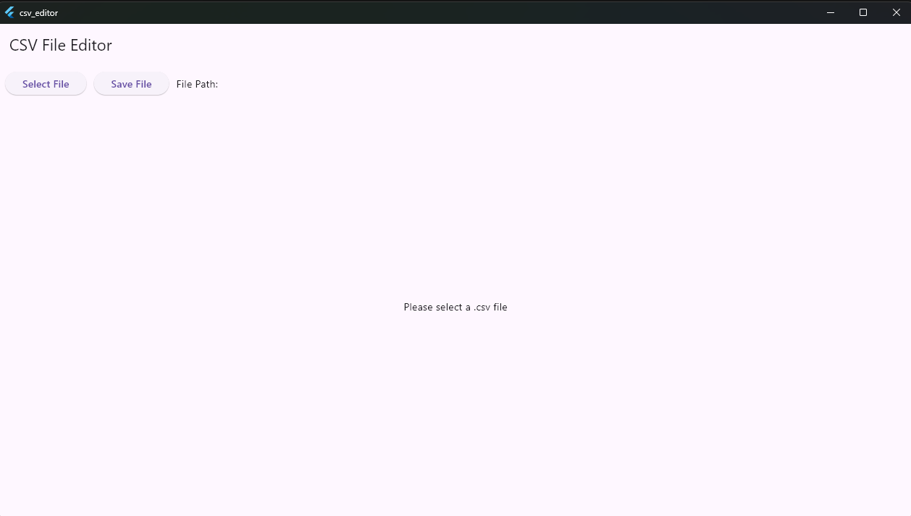

# csv_editor

- [csv\_editor](#csv_editor)
  - [Build](#build)
  - [Screenshot](#screenshot)

A toy CSV editor written in Flutter.

## Build

```bash
flutter pub get
flutter build windows
```

## Screenshot


